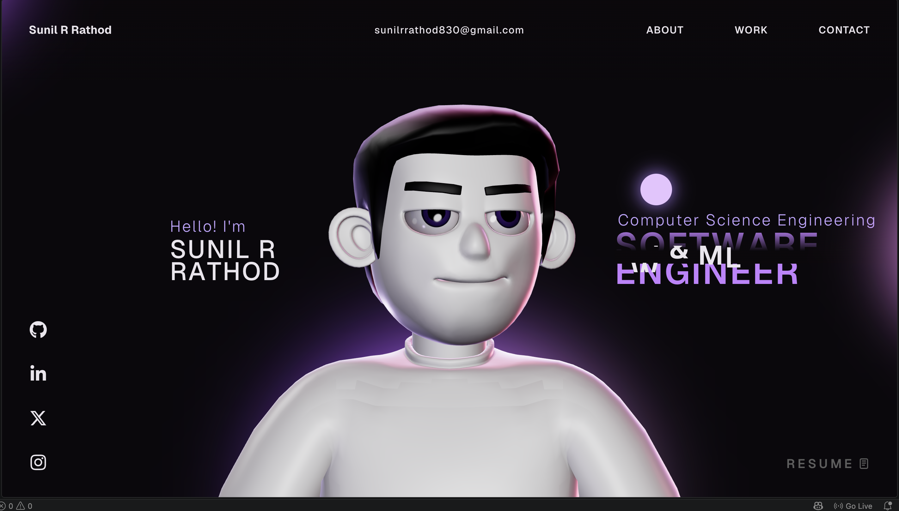
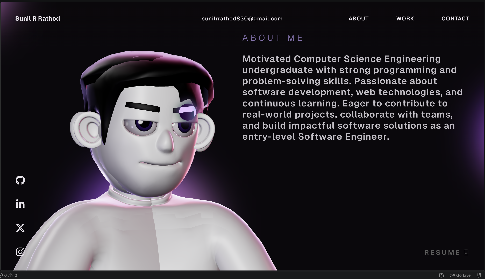
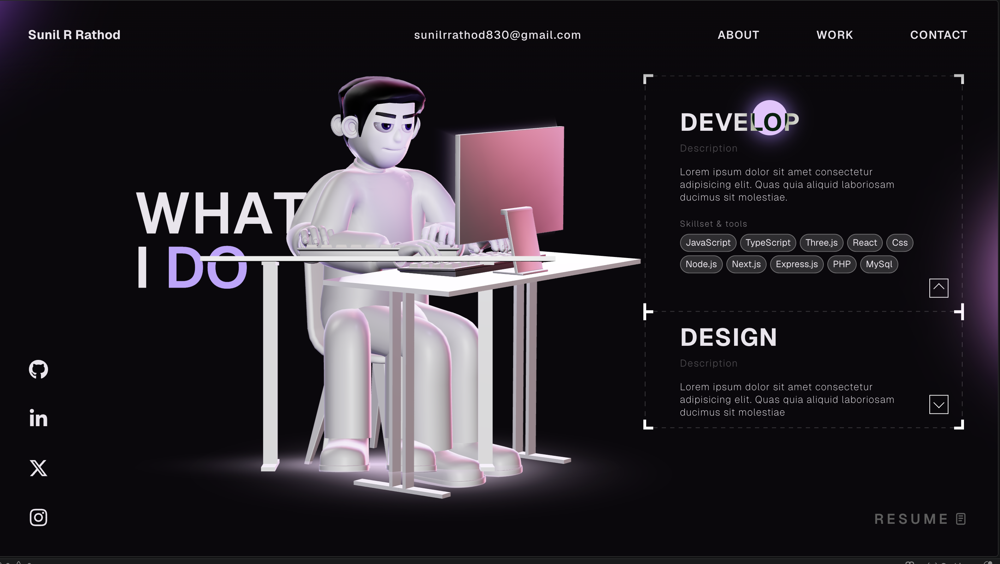
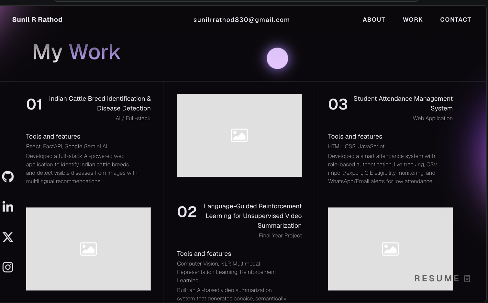
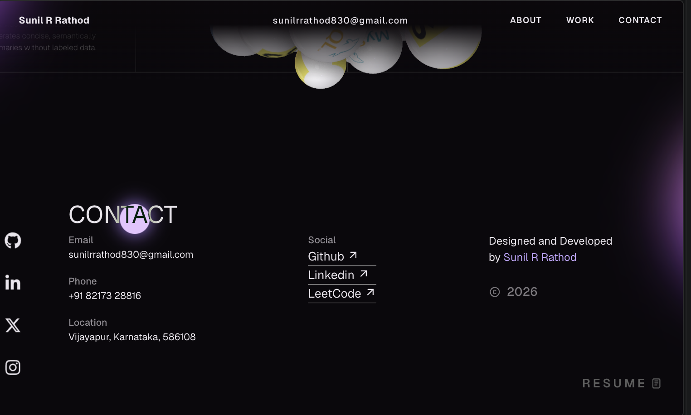

<<<<<<< HEAD
# 🌐 Sunil R Rathod - Developer Portfolio

<div align="center">


### 🚀 Modern Developer Portfolio Website

A responsive and interactive portfolio website built using **React, TypeScript, Vite, Three.js, and GSAP** showcasing my projects, skills, certifications, and achievements.

⭐ If you like this project, don't forget to star the repository.

</div>

---

# 🌍 Live Demo

### Portfolio

👉 https://your-portfolio.vercel.app

---

# 📸 Screenshots

# 📸 Screenshots

## 🏠 Home Page

<p align="center">
  
</p>

## 👨 About Section

<p align="center">
  
</p>

## 💻 Skills Section

<p align="center">
  
</p>

## 🚀 Projects Section

<p align="center">
  
</p>

## 📞 Contact Section

<p align="center">
  
</p>

## 🏠 Home Page


---

## 👨 About Section


---

## 💻 Skills Section


---

## 🚀 Projects Section


---

## 📞 Contact Section


---

# 📖 About Project

This portfolio website was developed to showcase my professional profile, technical skills, certifications, and software development projects.

The website follows modern UI/UX principles and is fully responsive across desktop, tablet, and mobile devices.

It provides visitors with an overview of my journey as a Computer Science Engineering student and demonstrates my experience in Full Stack Development, AI, and modern web technologies.

---

# ✨ Features

## 🎨 User Interface

✔ Modern Design

✔ Responsive Layout

✔ Interactive Animations

✔ Smooth Scrolling

✔ Beautiful Typography

✔ Gradient Effects

✔ Mobile Friendly

✔ Dark Theme

---

## 👨‍💻 Portfolio Features

✔ Hero Section

✔ About Me

✔ Skills

✔ Experience

✔ Certifications

✔ Featured Projects

✔ Contact Form

✔ Resume Download

✔ Social Media Links

---

## ⚡ Performance

✔ Fast Loading

✔ Optimized Images

✔ Code Splitting

✔ SEO Friendly

✔ Reusable Components

✔ Clean Architecture

---

# 🛠 Tech Stack

| Technology | Purpose |
|------------|----------|
| React | Frontend Framework |
| TypeScript | Type Safety |
| Vite | Build Tool |
| Three.js | 3D Graphics |
| React Three Fiber | 3D Rendering |
| GSAP | Animations |
| HTML5 | Structure |
| CSS3 | Styling |
| JavaScript | Logic |

---

# 📂 Project Structure

```
Portfolio-Website
│
├── public
│
├── images
│   ├── Home Screenshot
│   ├── About Screenshot
│   ├── Skills Screenshot
│   ├── Projects Screenshot
│   └── Contact Screenshot
│
├── src
│   ├── assets
│   ├── components
│   ├── context
│   ├── data
│   ├── App.tsx
│   └── main.tsx
│
├── package.json
├── vite.config.ts
└── README.md
```

---

# 🚀 Installation

Clone Repository

```bash
git clone https://github.com/SunilRRathod830/Portfolio-Website.git
```

Go to project directory

```bash
cd Portfolio-Website
```

Install dependencies

```bash
npm install
```

Run project

```bash
npm run dev
```

Production Build

```bash
npm run build
```

Preview

```bash
npm run preview
```

---

# 💼 Featured Projects

## 🎓 Student Attendance Management System

### Features

- Admin Login
- Lecturer Login
- Live Attendance
- Attendance Analytics
- CSV Import & Export
- Email Notifications
- WhatsApp Notifications
- 75% Attendance Monitoring
- CIE Eligibility System

Technology Used

- HTML
- CSS
- JavaScript
- Local Storage

---

## 🤖 Language Guided Reinforcement Learning

Research-based AI project for unsupervised video summarization using multimodal representation learning.

Technology

- Python
- Deep Learning
- Reinforcement Learning

---

# 🎓 Certifications

- NPTEL
- Cisco Networking Academy
- IBM SkillsBuild
- Infosys Springboard
- Oracle Academy
- Great Learning

---

# 📱 Responsive Design

Supports

- Desktop
- Laptop
- Tablet
- Android
- iPhone

---

# 📈 Performance

| Metric | Status |
|---------|--------|
| Responsive | ✅ |
| Mobile Friendly | ✅ |
| Fast Loading | ✅ |
| SEO Optimized | ✅ |
| Modern UI | ✅ |
| Reusable Components | ✅ |

---

# 📬 Contact

## 👨‍💻 Sunil R Rathod

📧 Email

your-email@gmail.com

🌐 Portfolio

https://your-portfolio.vercel.app

💼 LinkedIn

https://linkedin.com/in/your-profile

💻 GitHub

https://github.com/SunilRRathod830

---

# ⭐ Future Improvements

- Blog Section
- Visitor Counter
- Admin Dashboard
- Project Filters
- Multi-language Support
- Theme Switcher
- Resume Analytics
- Contact Email Integration

---

# 🤝 Contributing

Contributions are always welcome.

Fork the repository.

Create your feature branch.

```bash
git checkout -b feature/NewFeature
```

Commit changes.

```bash
git commit -m "Added New Feature"
```

Push branch.

```bash
git push origin feature/NewFeature
```

Open Pull Request.

---

# 📄 License

Licensed under the MIT License.

---

<div align="center">

## 👨‍💻 Developed by

# Sunil R Rathod

Computer Science Engineering Undergraduate

### ⭐ Thanks for visiting my repository!

If you found this project useful, please give it a ⭐.

</div>
=======
# -Sunil-R-Rathod---Portfolio
>>>>>>> 6f5eec55db2d6c65a93fc56eb38494493b8c3d09
